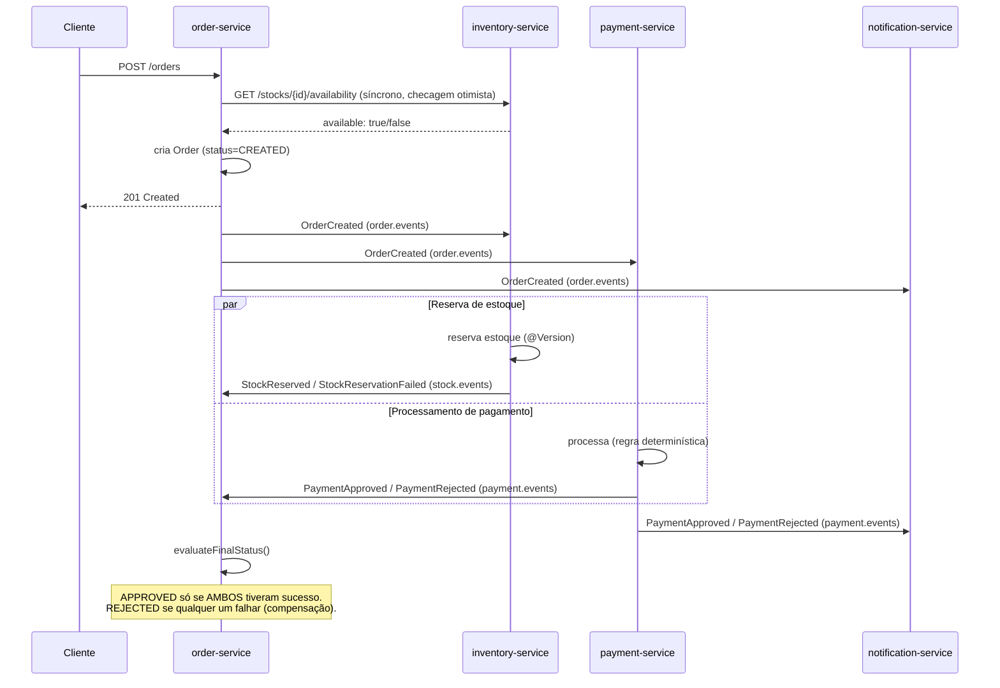

# Order Processing System

[🇺🇸 English](README.md)

Um sistema de processamento de pedidos com SAGA coreografada, construído com 4 microsserviços Spring Boot independentes, projetado para explorar problemas reais de sistemas distribuídos — comunicação síncrona vs. assíncrona, consistência eventual, compensação de SAGA, consumidores idempotentes, dead-letter queues e circuit breakers — num backend real, em nível de produção. Construído como projeto de portfólio para vagas de estágio/júnior em backend Java.

O sistema permite que um cliente crie um pedido com um ou mais produtos. O `order-service` verifica de forma síncrona a disponibilidade de estoque antes de criar o pedido, depois publica um evento ao qual dois serviços independentes reagem em paralelo: o `payment-service` (que decide a aprovação com base no valor do pedido) e o `inventory-service` (que realiza a reserva real de estoque, protegida contra concorrência). O `order-service` só marca o pedido como `APPROVED` quando **ambos** os participantes reportam sucesso — e compensa (rejeita o pedido) se qualquer um dos dois falhar, mesmo que o outro já tenha tido sucesso.

## Por que esse projeto

A maioria dos projetos de portfólio para por aí: "serviço A chama serviço B via REST". Este projeto existe para ir além: o que acontece quando dois serviços independentes precisam concordar sobre um resultado sem uma transação compartilhada? O que acontece quando uma mensagem é entregue duas vezes? O que acontece quando um serviço downstream cai no meio do fluxo? O CourtFlow (meu projeto anterior) atacou concorrência e expiração orientada a eventos dentro de um único serviço — este ataca a mesma classe de problemas *entre* fronteiras de serviço.

## Funcionalidades

- **4 serviços independentes** — `order-service`, `inventory-service`, `payment-service`, `notification-service`, cada um com seu próprio banco de dados (ou nenhum, quando apropriado) e seu próprio bounded context.
- **SAGA coreografada com compensação** — o `order-service` só alcança um estado final (`APPROVED`/`REJECTED`) quando os dois participantes (pagamento e reserva de estoque) reportam seu resultado, independente da ordem de chegada; uma falha tardia em qualquer um dos dois lados reverte o pedido mesmo que o outro lado já tenha tido sucesso.
- **Comunicação síncrona + assíncrona, usadas deliberadamente** — REST (`RestClient`) para uma checagem otimista rápida de estoque antes da criação do pedido; RabbitMQ (topic exchanges) para todo fato que aconteceu depois disso (`OrderCreated`, `StockReserved`/`StockReservationFailed`, `PaymentApproved`/`PaymentRejected`).
- **Controle de concorrência real** — lock otimista (`@Version`) tanto em `Stock` (débito real de estoque) quanto em `Order` (múltiplos listeners concorrentes escrevendo no mesmo agregado), com `@Retryable` relendo e reaplicando a transição de estado em caso de conflito.
- **Consumidores idempotentes** — uma tabela dedicada `tb_processed_events` (constraint única em id + tipo do evento), escrita atomicamente junto com a operação de negócio, protege contra a entrega "pelo menos uma vez" do RabbitMQ causar débito de estoque ou pagamento duplicado.
- **Retry + dead-letter queues** — todo consumidor é protegido por um interceptor do Spring Retry com backoff exponencial; mensagens que esgotam as tentativas são republicadas numa DLQ dedicada por fila (nunca misturando tipos de evento diferentes) em vez de entrar em loop infinito.
- **Circuit breaker na chamada síncrona** — Resilience4j envolve a checagem de disponibilidade de estoque (`order-service → inventory-service`) com um circuit breaker (por fora) e retry (por dentro), de forma que um `inventory-service` degradado falhe rápido em vez de acumular tentativas contra um circuito já aberto.
- **Clean Architecture em todos os serviços** — camadas `domain` / `application` / `infrastructure`, portas de entrada/saída explícitas, use cases com responsabilidade única.
- **Cobertura de testes unitários na lógica de domínio crítica** — a máquina de estados da SAGA do `Order` (as duas ordens possíveis de evento, todos os caminhos de rejeição/compensação), `Stock.reserve()`, `Payment.process()`, e a orquestração do `CreateOrderUseCase` (com Mockito).

## Stack tecnológica

| Camada | Tecnologia |
|---|---|
| Linguagem / Runtime | Java 21 |
| Framework | Spring Boot 3.x |
| Arquitetura | Clean Architecture (`domain` / `application` / `infrastructure`) por serviço |
| Persistência | Spring Data JPA, PostgreSQL (um container, um banco por serviço) |
| Mensageria | RabbitMQ (topic exchanges, dead-letter queues, interceptor `spring-retry`) |
| Resiliência | Resilience4j (circuit breaker + retry) na chamada síncrona |
| Concorrência | Lock otimista (`@Version`) + `@Retryable` |
| Testes | JUnit 5, Mockito |
| Containerização | Docker, Docker Compose (multi-stage builds) |
| Build | Maven |

## Arquitetura

### Serviços

| Serviço | Papel | Expõe REST | Banco de dados |
|---|---|---|---|
| `order-service` | Orquestrador da SAGA (coreografada) — dono do agregado `Order` | `POST /orders`, `GET /orders/{id}` | `order_db` |
| `inventory-service` | Checagem de disponibilidade (síncrona) + reserva real de estoque (assíncrona) | `GET /stocks/{productId}/availability` | `inventory_db` |
| `payment-service` | Simulação determinística de pagamento (sem gateway real) | — | `payment_db` |
| `notification-service` | Consumidor terminal de eventos, loga uma notificação simulada | — | nenhum |

### Fluxo de eventos (SAGA coreografada)



`inventory-service` e `payment-service` reagem ao `OrderCreated` de forma **independente e em paralelo** — nenhum sabe da existência do outro. O `order-service` é o único lugar que reconcilia os dois resultados, via `Order.markStockReserved()` / `markStockFailed()` / `markPaymentApproved()` / `markPaymentRejected()`, cada um reavaliando se o pedido já pode alcançar um estado final.

### Clean Architecture (por serviço)

```
domain/
  model/       → entidades e máquinas de estado (Order, Stock, Payment), núcleo sem dependência de framework
  event/       → records de eventos de domínio (duplicados propositalmente por serviço — cada bounded context é dono do seu próprio contrato)
  exception/   → exceções de negócio

application/
  usecase/     → um use case por operação
  port/
    in/        → portas de entrada (o que um controller/listener chama)
    out/       → portas de saída (o que um use case precisa — repositório, publicador de evento, cliente HTTP)
  dto/         → commands (formato de entrada voltado à aplicação)

infrastructure/
  web/         → controllers, DTOs de request/response, tratamento de exceção centralizado
  persistence/ → repositórios JPA e adapters
  messaging/   → configuração do RabbitMQ, publishers, listeners
  client/      → cliente HTTP síncrono baseado em RestClient (só order-service)
  config/      → configuração de resiliência, retry e mensageria
```

## Decisões de design que vale a pena ler

- **Checagem otimista de estoque ≠ reserva de estoque.** A chamada síncrona `GET /stocks/.../availability` é um filtro rápido de UX, não uma garantia — ela acontece *antes* do pedido existir. O débito real, protegido contra concorrência, acontece de forma assíncrona dentro do `inventory-service` quando ele consome `OrderCreated`, protegido por `@Version`. Isso evita uma condição de corrida (TOCTOU) entre dois clientes checando o mesmo produto ao mesmo tempo.
- **Payloads de evento são mínimos por consumidor, não compartilhados.** `OrderCreatedEvent` é declarado de forma independente em cada um dos três serviços que o consomem, e cada um carrega só os campos que aquele serviço realmente precisa (ex: `payment-service` nunca vê a lista de itens). Isso mantém o contrato de cada serviço desacoplado das necessidades internas dos outros — a leitura tolerante do Jackson garante que adicionar um campo no evento de origem nunca quebra um consumidor existente.
- **A compensação é simétrica.** Um pagamento rejeitado *depois* que o estoque já foi reservado, e uma reserva de estoque que falha *depois* que o pagamento já foi aprovado, ambos levam ao mesmo estado final `REJECTED` — o `evaluateFinalStatus()` do `Order` só chega a `APPROVED` quando os dois participantes reportam sucesso, independente de qual termina primeiro ou qual falha.
- **A idempotência é garantida no nível do banco de dados, não por uma checagem "check-then-act" em memória.** Duas mensagens idênticas chegando quase simultaneamente passariam pelas duas por uma checagem em memória de "já processei?"; só uma constraint única em `(event_id, event_type)`, escrita dentro da mesma transação da operação de negócio, torna a deduplicação atômica.
- **O retry (interceptor do Spring Retry) fica aninhado dentro do circuit breaker, nunca o contrário.** Se o circuito já está aberto, tentar de novo uma chamada que sabidamente vai falhar desperdiça tempo e anula o propósito de fail-fast do circuit breaker.

## Como rodar

### Opção 1 — Docker Compose (recomendado)

```bash
git clone https://github.com/Rangeldev73/order-processing-system.git
cd order-processing-system
cp .env.example .env
# ajuste as credenciais no .env se quiser
docker-compose up --build
```

Isso constrói e sobe os 4 serviços junto com PostgreSQL e RabbitMQ, com healthchecks garantindo que a infraestrutura esteja pronta antes das aplicações subirem.

| Serviço | Porta |
|---|---|
| `order-service` | 8080 |
| `inventory-service` | 8081 |
| `payment-service` | 8082 |
| `notification-service` | — (sem endpoint REST) |
| Management UI do RabbitMQ | 15672 |
| PostgreSQL | 5433 |

### Opção 2 — Rodar localmente via IDE

Cada serviço pode ser executado de forma independente pela sua IDE. Você vai precisar do PostgreSQL e do RabbitMQ disponíveis (o `docker-compose.yml` na raiz do repositório pode subir só a infraestrutura) e das variáveis de ambiente listadas no `application.properties` de cada serviço configuradas na sua run configuration.

### Populando dados de estoque

O `inventory-service` ainda não expõe um endpoint de escrita para estoque (ver seção abaixo), então popule um produto manualmente:

```sql
INSERT INTO tb_stock (id, product_id, available_quantity, version)
VALUES (gen_random_uuid(), 'SKU-001', 100, 0);
```

### Testando

```bash
curl -X POST http://localhost:8080/orders \
  -H "Content-Type: application/json" \
  -d '{"customerId":"3fa85f64-5717-4562-b3fc-2c963f66afa6","items":[{"productId":"SKU-001","quantity":2,"unitPrice":100.00}]}'
```

Pedidos com total abaixo de R$1000 são aprovados pela regra determinística de pagamento; pedidos com total igual ou acima são rejeitados — útil para exercitar os dois resultados possíveis da SAGA.

## Testes

```bash
./mvnw test
```

Os testes unitários focam nas duas áreas mais importantes de verificar: lógica de domínio pura (máquinas de estado, sem nenhum framework envolvido) e orquestração de use case (com portas mockadas via Mockito). A resolução da SAGA do `Order` é testada nas duas ordens possíveis de evento (estoque-depois-pagamento e pagamento-depois-estoque) convergindo para o mesmo resultado, além de todos os caminhos de rejeição/compensação.

## Limitações conhecidas / pendências

- O `inventory-service` não tem endpoint de escrita para gestão de estoque (reposição é feita via SQL direto) — deliberadamente adiado, já que não era essencial para os objetivos de arquitetura deste projeto.
- O retry contra o RabbitMQ é stateless (em memória, via interceptor do Spring Retry) em vez do padrão nativo de dead-letter-exchange/TTL do RabbitMQ — uma escolha deliberada de simplicidade; o progresso do retry se perde se o serviço consumidor reiniciar no meio de uma tentativa.
- Não há API Gateway na frente dos 4 serviços — cada um é acessado diretamente pela sua própria porta.