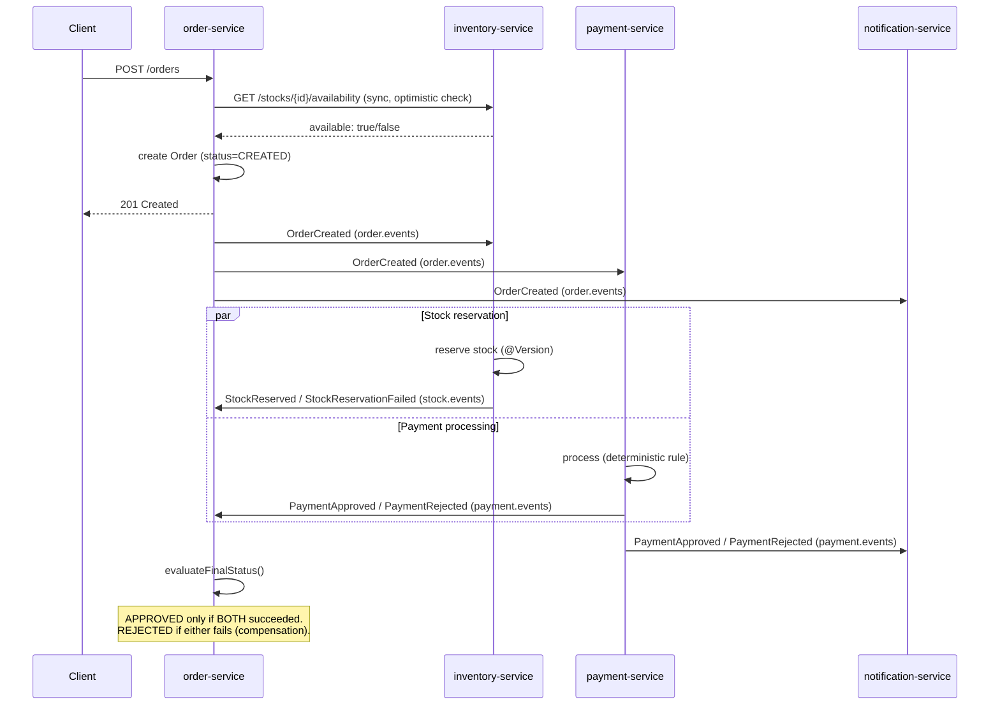

# Order Processing System

[🇧🇷 Português](README.PT-BR.md)

A choreographed-saga order processing system built with 4 independent Spring Boot microservices, designed to explore real distributed-systems problems — synchronous vs. asynchronous communication, eventual consistency, saga compensation, idempotent consumers, dead-letter queues, and circuit breakers — in a production-style backend. Built as a portfolio project for Java backend internship/junior roles.

The system lets a customer place an order for one or more products. `order-service` synchronously checks stock availability before creating the order, then publishes an event that two independent services react to in parallel: `payment-service` (which decides approval based on order value) and `inventory-service` (which performs the real, concurrency-safe stock reservation). `order-service` only marks the order `APPROVED` once **both** participants report success — and compensates (rejects the order) if either one fails, even if the other already succeeded.

## Why this project

Most portfolio projects stop at "service A calls service B over REST." This project exists to go further: what happens when two independent services need to agree on an outcome without a shared transaction? What happens when a message is delivered twice? What happens when a downstream service goes down mid-flow? CourtFlow (my previous project) tackled concurrency and event-driven expiration inside a single service — this one tackles the same class of problems *across* service boundaries.

## Features

- **4 independent services** — `order-service`, `inventory-service`, `payment-service`, `notification-service`, each with its own database (or no database, where appropriate) and its own bounded context.
- **Choreographed saga with compensation** — `order-service` reaches a final state (`APPROVED`/`REJECTED`) only once both the payment and stock reservation participants report their outcome, regardless of arrival order; a late failure on either side reverses the order even if the other side already succeeded.
- **Synchronous + asynchronous communication, used deliberately** — REST (`RestClient`) for a fast optimistic stock check before order creation; RabbitMQ (topic exchanges) for every fact that happened after that (`OrderCreated`, `StockReserved`/`StockReservationFailed`, `PaymentApproved`/`PaymentRejected`).
- **Real concurrency control** — optimistic locking (`@Version`) on both `Stock` (real inventory debit) and `Order` (concurrent listeners writing to the same aggregate), with `@Retryable` re-reading and reapplying the state transition on conflict.
- **Idempotent consumers** — a dedicated `tb_processed_events` table (unique constraint on event id + type), written atomically with the business operation, protects against RabbitMQ's at-least-once delivery causing duplicate stock debits or duplicate payments.
- **Retry + dead-letter queues** — every consumer is protected by a Spring Retry interceptor with exponential backoff; exhausted messages are republished to a dedicated DLQ per queue (never mixed across event types) instead of looping forever.
- **Circuit breaker on the synchronous call** — Resilience4j wraps the stock-availability check (`order-service → inventory-service`) with a circuit breaker (outer) and retry (inner), so a degraded `inventory-service` fails fast instead of piling up retries against an already-open circuit.
- **Clean Architecture in every service** — `domain` / `application` / `infrastructure` layering, explicit input/output ports, use cases with a single responsibility.
- **Unit test coverage on the critical domain logic** — `Order`'s saga state machine (both event orderings, all rejection/compensation paths), `Stock.reserve()`, `Payment.process()`, and `CreateOrderUseCase` orchestration (Mockito).

## Tech stack

| Layer | Technology |
|---|---|
| Language / Runtime | Java 21 |
| Framework | Spring Boot 3.x |
| Architecture | Clean Architecture (`domain` / `application` / `infrastructure`) per service |
| Persistence | Spring Data JPA, PostgreSQL (one container, one database per service) |
| Messaging | RabbitMQ (topic exchanges, dead-letter queues, `spring-retry` interceptor) |
| Resilience | Resilience4j (circuit breaker + retry) on the synchronous call |
| Concurrency | Optimistic locking (`@Version`) + `@Retryable` |
| Testing | JUnit 5, Mockito |  
| Containerization | Docker, Docker Compose (multi-stage builds) |
| Build | Maven |

## Architecture

### Services

| Service | Role | Exposes REST | Database |
|---|---|---|---|
| `order-service` | Saga orchestrator (choreographed) — owns the `Order` aggregate | `POST /orders`, `GET /orders/{id}` | `order_db` |
| `inventory-service` | Stock availability check (sync) + real stock reservation (async) | `GET /stocks/{productId}/availability` | `inventory_db` |
| `payment-service` | Deterministic payment simulation (no real gateway) | — | `payment_db` |
| `notification-service` | Terminal event consumer, logs a simulated notification | — | none |

### Event flow (choreographed saga)



Both `inventory-service` and `payment-service` react to `OrderCreated` **independently and in parallel** — neither knows about the other. `order-service` is the only place that reconciles the two outcomes, via `Order.markStockReserved()` / `markStockFailed()` / `markPaymentApproved()` / `markPaymentRejected()`, each re-evaluating whether the order can reach a final state.

### Clean Architecture (per service)

```
domain/
  model/       → entities and state machines (Order, Stock, Payment), zero framework dependency in the core logic
  event/       → domain event records (duplicated per service on purpose — each bounded context owns its own contract)
  exception/   → business exceptions

application/
  usecase/     → one use case per operation
  port/
    in/        → input ports (what a controller/listener calls)
    out/       → output ports (what a use case needs — repository, event publisher, HTTP client)
  dto/         → commands (application-facing input shape)

infrastructure/
  web/         → controllers, request/response DTOs, centralized exception handling
  persistence/ → JPA repositories and adapters
  messaging/   → RabbitMQ config, publishers, listeners
  client/      → RestClient-based synchronous HTTP client (order-service only)
  config/      → resilience, retry and messaging configuration
```

## Design decisions worth reading

- **Optimistic stock check ≠ stock reservation.** The synchronous `GET /stocks/.../availability` call is a fast UX filter, not a guarantee — it happens *before* the order exists. The real, concurrency-safe debit happens asynchronously inside `inventory-service` when it consumes `OrderCreated`, protected by `@Version`. This avoids a TOCTOU race between two customers checking the same product at once.
- **Event payloads are minimal per consumer, not shared.** `OrderCreatedEvent` is declared independently in each of the three services that consume it, and each one only carries the fields that service actually needs (e.g. `payment-service` never sees the item list). This keeps each service's contract decoupled from the others' internal needs — Jackson's tolerant reading means adding a field to the source event never breaks an existing consumer.
- **Compensation is symmetric.** A payment rejected *after* stock was already reserved, and a stock reservation that fails *after* payment was already approved, both lead to the same final `REJECTED` state — `Order`'s `evaluateFinalStatus()` only reaches `APPROVED` when both participants report success, regardless of which one finishes first or which one fails.
- **Idempotency is enforced at the database level, not by an in-memory check-then-act.** Two identical messages arriving near-simultaneously would both pass an in-memory "already processed?" check; only a unique constraint on `(event_id, event_type)`, written inside the same transaction as the business operation, makes deduplication atomic.
- **Retry (Spring Retry interceptor) is nested inside the circuit breaker, never the other way around.** If the circuit is already open, retrying a call that's guaranteed to fail wastes time and defeats the fail-fast purpose of the breaker.

## How to run

### Option 1 — Docker Compose (recommended)

```bash
git clone https://github.com/Rangeldev73/order-processing-system.git
cd order-processing-system
cp .env.example .env
# adjust credentials in .env if you'd like
docker-compose up --build
```

This builds and starts all 4 services plus PostgreSQL and RabbitMQ, with health checks ensuring the infrastructure is ready before the applications start.

| Service | Port |
|---|---|
| `order-service` | 8080 |
| `inventory-service` | 8081 |
| `payment-service` | 8082 |
| `notification-service` | — (no REST endpoint) |
| RabbitMQ management UI | 15672 |
| PostgreSQL | 5433 |

### Option 2 — Run locally via IDE

Each service can be run independently from your IDE. You'll need PostgreSQL and RabbitMQ available (the `docker-compose.yml` in the repo root can start just the infrastructure) and the environment variables listed in each service's `application.properties` configured in your run configuration.

### Seeding stock data

`inventory-service` doesn't yet expose a write endpoint for stock (tracked below), so seed a product manually:

```sql
INSERT INTO tb_stock (id, product_id, available_quantity, version)
VALUES (gen_random_uuid(), 'SKU-001', 100, 0);
```

### Try it

```bash
curl -X POST http://localhost:8080/orders \
  -H "Content-Type: application/json" \
  -d '{"customerId":"3fa85f64-5717-4562-b3fc-2c963f66afa6","items":[{"productId":"SKU-001","quantity":2,"unitPrice":100.00}]}'
```

Orders under R$1000 total are approved by the deterministic payment rule; orders at or above that are rejected — useful for exercising both saga outcomes.

## Testing

```bash
./mvnw test
```

Unit tests focus on the two areas most worth verifying: pure domain logic (state machines, no framework involved) and use case orchestration (with Mockito-mocked ports). `Order`'s saga resolution is tested for both possible event orderings (stock-then-payment and payment-then-stock) converging on the same result, plus every rejection/compensation path.

## Known limitations / open items

- `inventory-service` has no write endpoint for stock management (restocking is done via direct SQL) — deliberately deferred, as it wasn't essential to the architecture goals of this project.
- Retry against RabbitMQ is stateless (in-memory, via Spring Retry interceptor) rather than the native RabbitMQ dead-letter-exchange/TTL pattern — a deliberate simplicity trade-off; retry progress is lost if the consuming service restarts mid-attempt.
- No API Gateway in front of the 4 services — each is reached directly on its own port.